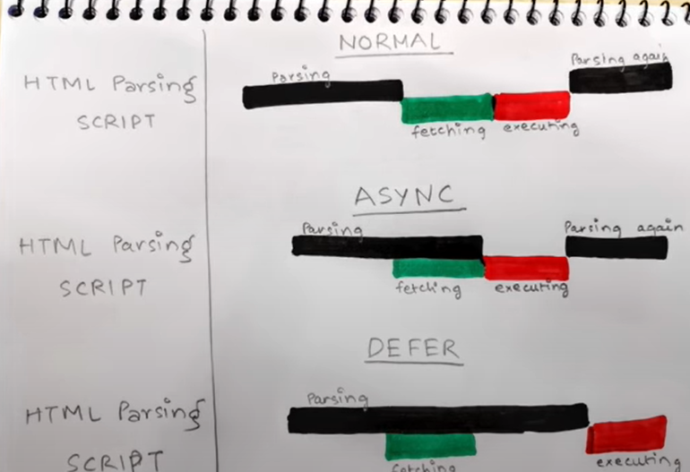

| Asynchronous | Deferred |
|:-------------|:---------|
| Asynchronous blocks the parsing of the page. | Deferred never blocks the page. |
| Asynchronous scripts don’t wait for each other. So if a smaller script is second in the order, it will be loaded before the previous longer one. | Deferred scripts maintain their relative order which means the first script will be loaded first while all others below it will have to wait. |
| The execution of scripts begins by pause parsing.	| However, the execution of scripts begins only after parsing is completely finished but before the document’s DOMContentLoadedevent. |