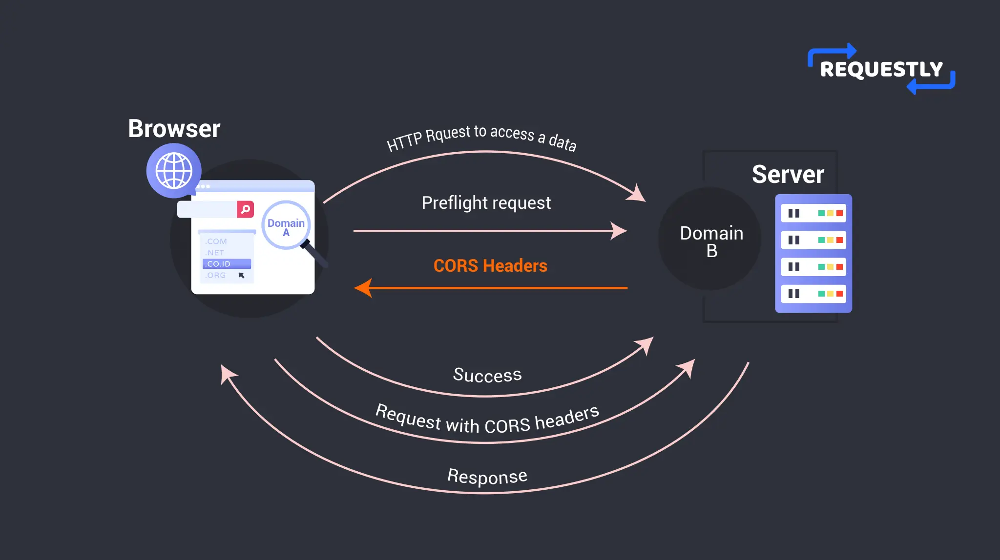

# Cross Origin Resource Sharing(CORS)

It is a mechanism which uses additional HTTP headers to tell the browser whether a specific browser can share the resource with the another browser. Also, both the web apps should have different origins(domains).

- **CORS Preflight Mechanism:** A preflight(Options) call is made before the actual API call. Then this CORS mechanism(from server browser) uses additional HTTP headers to verify this request first.
After the server verifies that call is safe then the actual API call is made.
- **Additional HTTP headers:**
  - **Accept-Control-Allow-Origin:** This is set by the server. It can have different values(*: any domain outside can access this server, 'domain name': to restrict it for this domain only.)
  - **Access-Control-Allow-Methods:** To restrict API methods PUT, POST, etc.

